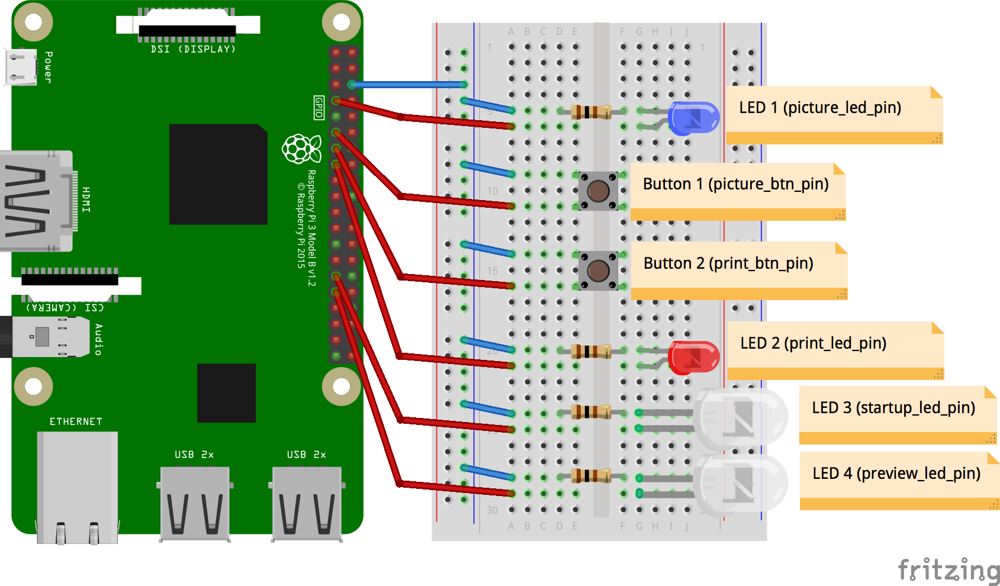

The ``pibooth`` project attempts to provide a Photo Booth application *out-of-the-box*
for Raspberry Pi.

Requirements
------------

The requirements listed below are the one used for the development of ``pibooth``, but
other configuration may work fine. All hardware buttons and lights are optional.

Hardware:
^^^^^^^^^

* 1 Raspberry Pi Model B+
* 1 Camera (Pi Camera v2.1 8 MP 1080p or any Camera compatible with ``gphoto2``)
* 2 push buttons
* 1 LED
* 1 resistor of 100 Ohm

Software:
^^^^^^^^^

* Python ``3.5.3``
* RPi.GPIO ``0.6.3``
* picamera ``1.13``
* PIL ``1.1.7``
* pygame ``1.9.3``
* gphoto2 ``1.8.0`` ( libgphoto2 ``2.5.15`` )

Install
-------

A brief description on how to set-up a Raspberry Pi to use this software.

1. Download latest Raspbian image and set-up an SD-card. You can follow
   `these instructions <https://www.raspberrypi.org/documentation/installation/installing-images/README.md>`_
2. Insert the SD-card into the Raspberry Pi and fire it up. Use the raspi-config tool that is shown
   automatically on the first boot to configure your system (e.g., expand partition, change hostname,
   password, enable SSH, configure to boot into GUI, etc.)
3. Reboot and open a terminal. Install the latest firmware versions

   ::

        $ sudo rpi-update
4. Upgrade all installed software

   ::

        $ sudo apt-get update
        $ sudo apt-get upgrade
5. Install ``gphoto2`` (required only for external Camera)

   ::

        $ sudo wget raw.github.com/gonzalo/gphoto2-updater/master/gphoto2-updater.sh
        $ sudo chmod 755 gphoto2-updater.sh
        $ sudo ./gphoto2-updater.sh
6. Install ``pibooth`` from the pypi repository (available soon)

   ::

        $ sudo pip install pibooth

Run
---

Start the Photo Booth application using the command::

    $ pibooth

After the graphical interface is started, the following actions are available:

==================== ================ ================
Action               Keyboard key     Physical button
==================== ================ ================
Toggle Full screen   Ctrl + F         \-
Take pictures        P                Button 1
Export Printer/Cloud Ctrl + E         Button 2
Quit                 ESC              \-
==================== ================ ================

All pictures taken are stored in a subfolder of the one defined in the configuration,
named **YYYY-mm-dd hh-mm-ss** which the time when first photo of the sequence was taken.

Configuration
-------------

At the first run, a configuration file is generated in ``~/.config/pibooth/pibooth.cfg``
which permits to configure the behavior of the application. The configuration can be
easily edited using the command::

    $ pibooth --config

The default configuration can be restored with the command::

    $ pibooth --reset

Below is the default configuration file:

.. code-block:: ini

    [GENERAL]
    # Path to save images
    directory = ~/Pictures/pibooth

    # Clear previously stored photos
    clear_on_startup = True

    # How long to debounce the button in seconds
    debounce_delay = 0.3

    [WINDOW]
    # (Width, Height) of the display monitor
    size = (800, 480)

    # Show a counter between taking photos
    capture_counter = True

    # How long is the preview in seconds
    preview_delay = 3

    # Preview window position related to the main window
    preview_offset = (50, 60)

    [PICTURE]
    # How many pictures to take (4 max)
    captures = 4

    # First text displayed
    footer_text1 = Footer 1

    # Second text displayed
    footer_text2 = Footer 2

    # Footer text RGB color
    text_color = (0, 0, 0)

    # Background RGB color
    bg_color = (255, 255, 255)

    [CAMERA]
    # Resolution for camera captures (see picamera modes)
    resolution = (3280, 2464)

    # Adjust for lighting issues. Normal is 100 or 200. Dark is 800 max
    iso = 100

Circuit diagram
---------------

Credits:
--------

Icons from the Noun Project

 - Button by Prerak Patel
 - Disco pose by Moriah Rich
 - Fireworks by Creative Stall
 - Hamster wheel by Dream Icons
 - Tap by Prerak Patel
 - Yoga poses by Claire Jones

The code was developed from scratch but inspired by the following tutorials/projects:

 - https://github.com/reuterbal/photobooth
 - http://www.instructables.com/lesson/Build-a-Photo-Booth
 - http://www.instructables.com/id/Raspberry-Pi-photo-booth-controller
 - http://www.instructables.com/id/Lininger-Rood-Photo-Booth
