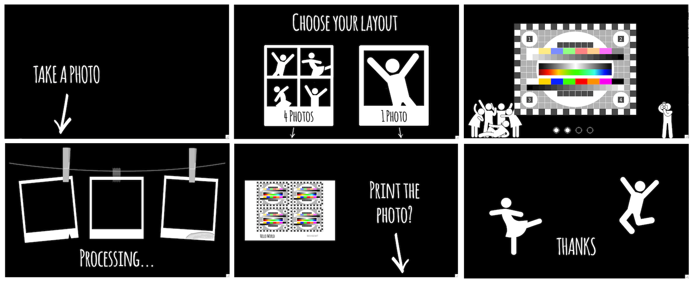

Welcome to Pibooth's documentation!
===================================

|Pibooth|

|PythonVersions| |PypiPackage| |Downloads|

The ``pibooth`` project provides a photobooth application *out-of-the-box* in
pure Python for Raspberry Pi. Have a look to the `wiki <https://github.com/pibooth/pibooth/wiki>`_
to discover some realizations from GitHub users, and don't hesitate to send us
photos of your version.

.. note:: Even if designed for a Raspberry Pi, this software may be installed on
          any Unix/Linux based OS (tested on Ubuntu 16 and Mac OSX 10.14.6).

.. toctree::
   :caption: About
   :maxdepth: 2

   sources/about.rst
   sources/examples.rst

.. toctree::
   :caption: Install
   :maxdepth: 2

   sources/install.rst

.. toctree::
   :caption: Start
   :maxdepth: 2

   sources/start.rst
   sources/config/config.rst
   sources/tutorials/dslr_tips.rst

.. toctree::
   :caption: Scripts and tools
   :maxdepth: 2

   sources/scripts.rst

.. toctree::
   :caption: Plugins
   :maxdepth: 2

   sources/plugins/plugins.rst
   sources/plugins/hooks.rst
   sources/plugins/examples.rst

.. toctree::
   :caption: Developers
   :hidden:

   sources/dev/install.rst
   sources/dev/rules.rst
   sources/dev/release.rst

Indices and tables
==================

* :ref:`genindex`
* :ref:`modindex`
* :ref:`search`

.. |Pibooth| image:: pibooth.png
   :target: https://www.pibooth.org
   :align: middle

.. |PythonVersions| image:: https://img.shields.io/badge/python-3.6+-red.svg
   :target: https://www.python.org/downloads
   :alt: Python 3.6+

.. |PypiPackage| image:: https://badge.fury.io/py/pibooth.svg
   :target: https://pypi.org/project/pibooth
   :alt: PyPi package

.. |Downloads| image:: https://img.shields.io/pypi/dm/pibooth?color=purple
   :target: https://pypi.org/project/pibooth
   :alt: PyPi downloads
