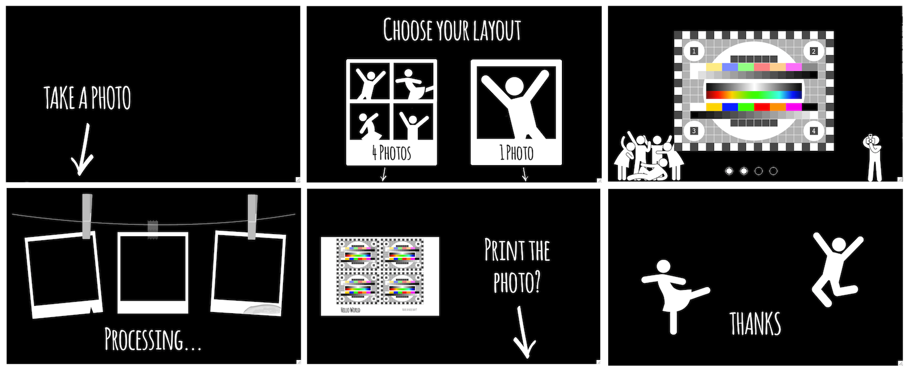
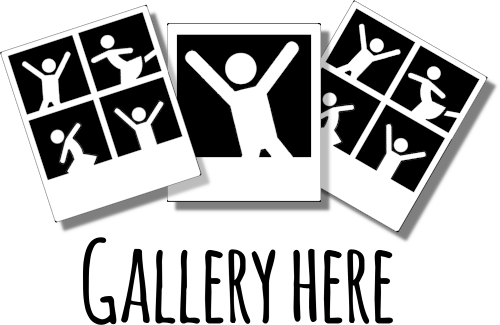

|Pibooth| |BeerPay|

|PythonVersions| |PypiPackage| |Downloads|

The ``pibooth`` project provides a photobooth application *out-of-the-box* in pure Python
for Raspberry Pi. Have a look to the `wiki <https://github.com/pibooth/pibooth/wiki>`_
to discover some realizations from GitHub users, and don't hesitate to send us photos of your version.

.. note:: Even if designed for a Raspberry Pi, this software may be installed on any Unix/Linux
          based OS (tested on Ubuntu 16 and Mac OSX 10.14.6).

Features
--------

* Interface available in Danish, Dutch, English, French, German, Hungarian, Norwegian and Spanish (customizable)
* Capture from 1 to 4 photos and concatenate them in a final picture
* Support all cameras compatible with gPhoto2, OpenCV and Raspberry Pi
* Support for hardware buttons and lamps on Raspberry Pi GPIO
* Fully driven from hardware buttons / keyboard / mouse / touchscreen
* Auto-start at the Raspberry Pi startup
* Animate captures from the last sequence during idle time
* Store final pictures and the individual captures
* Printing final pictures using CUPS server (printing queue indication)
* Custom texts can be added on the final picture (customizable fonts, colors, alignments)
* Custom background(s) and overlay(s) can be added on the final picture
* All settings available in a configuration file (most common options in a graphical interface)
* Highly customizable thanks to its plugin system, you can develop your own plugin

Gallery
-------

You can see some examples of the output picture formats you can get with ``pibooth`` on the following page.

Requirements
------------

The requirements listed below are the ones used for the development of ``pibooth``, but
other configuration may work fine. **All hardware buttons, lights and printer are optional**,
the application can be entirely controlled using a keyboard, a mouse or a touchscreen.

.. warning:: Using a Pi Camera, the preview is visible only on a screen connected to the HDMI or
             DSI connectors (the preview is an overlay managed at GPU low level). It also means
             that ``pibooth`` can not be started throught SSH tuneling. Even with X11 forwarding
             enabled (``ssh -X ...``) the preview will not be visible.

Hardware
^^^^^^^^

* 1 Raspberry Pi 3 Model B (or higher)
* 1 Camera (Raspberry Pi Camera v2.1 8 MP 1080p
  or any DSLR camera `compatible with gPhoto2 <http://www.gphoto.org/proj/libgphoto2/support.php>`_
  or any webcam `compatible with OpenCV <https://opencv.org>`_ )
* 2 push buttons
* 2 LEDs
* 2 resistors of 100 Ohm
* 1 printer

Software
^^^^^^^^

* Raspberry Pi OS with desktop
* Python ``3.7.3``
* libsdl2 ``2.0``
* libgphoto2 ``2.5.27``
* libcups ``2.2.10``

Terms and conditions
--------------------

See the LICENSE file to have details on the terms and coniditions.

GDPR advices
^^^^^^^^^^^^

``pibooth`` was developed for a private usage with no connection to a professional or commercial activity,
as a consequence GDPR does not apply.
However if you are using photobooth in Europe, it is your responsability to check that your usage and
more particularly the usage of the pictures generated by ``pibooth`` follows the GDPR rules, especially make
sure that the people that will use the ``pibooth`` are aware that the image will be stored on the device.

Credits
^^^^^^^

Pibooth icon from `Artcore Illustrations <https://www.iconspedia.com/icon/photobooth-icon-29464.html>`_

Icons from the Noun Project (https://thenounproject.com/)

- Polaroid by icon 54
- Up hand drawn arrow by Kid A
- Cameraman and Friends Posing For Camera by Gan Khoon Lay
- Camera by Alfa Design
- Print Photo by Kmg Design
- Pointer hand by Peter van Driel

Support us on Beerpay
---------------------

If you want to help us you can by clicking on the following links!

|BeerPay| |BeerPay2|

.. |BeerPay| image:: https://beerpay.io/werdeil/pibooth/badge.svg?style=beer-square
   :align: middle
   :target: https://beerpay.io/werdeil/pibooth

.. |BeerPay2| image:: https://beerpay.io/werdeil/pibooth/make-wish.svg?style=flat-square
   :align: middle
   :target: https://beerpay.io/werdeil/pibooth?focus=wish

.. |Pibooth| image:: images/pibooth.png
   :align: middle

.. |PythonVersions| image:: https://img.shields.io/badge/python-3.6+-red.svg
   :target: https://www.python.org/downloads
   :alt: Python 3.6+

.. |PypiPackage| image:: https://badge.fury.io/py/pibooth.svg
   :target: https://pypi.org/project/pibooth
   :alt: PyPi package

.. |Downloads| image:: https://img.shields.io/pypi/dm/pibooth?color=purple
   :target: https://pypi.org/project/pibooth
   :alt: PyPi downloads