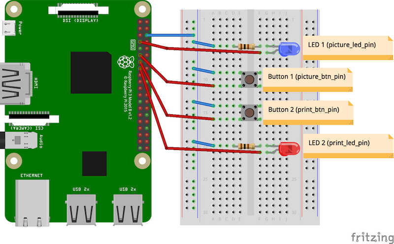

Requirements
------------

The requirements listed below are the ones used for the development of ``pibooth``,
but other configuration may work fine. **All hardware buttons, lights and printer
are optional**, the application can be entirely controlled using a keyboard, a
mouse or a touchscreen.

.. warning:: Using a Pi Camera, the preview is visible only on a screen connected
             to the HDMI or DSI connectors (the preview is an overlay managed at
             GPU low level). It also means that ``pibooth`` can not be started
             throught SSH tuneling. Even with X11 forwarding enabled (``ssh -X ...``)
             the preview will not be visible.

Hardware
^^^^^^^^

* 1 Raspberry Pi 3 Model B (or higher)
* 1 Camera (Raspberry Pi Camera v2.1 8 MP 1080p
  or any DSLR camera `compatible with gPhoto2 <http://www.gphoto.org/proj/libgphoto2/support.php>`_
  or any webcam `compatible with OpenCV <https://opencv.org>`_ )
* 2 push buttons
* 2 LEDs
* 2 resistors of 100 Ohm
* 1 printer

Software
^^^^^^^^

* Raspberry Pi OS **Buster** (32 bit) with desktop (`could be downloaded here <https://downloads.raspberrypi.org/raspios_oldstable_armhf/images/>`_)
* Python ``3.7.3``
* libsdl2 ``2.0``
* libgphoto2 ``2.5.27``
* libcups ``2.2.10``

Install
-------

Here is a brief description on how to set-up a Raspberry Pi to use this software.

If you intend to develop on ``pibooth``, an editable/customizable version can be
installed. Instead of doing step 8. of the below procedure, follow
:ref:`instructions here<install_developing_version>`.

Manual procedure
^^^^^^^^^^^^^^^^

1. Download the Raspbian image and set-up an SD-card. You can follow
   `these instructions <https://www.raspberrypi.org/documentation/installation/installing-images/README.md>`_.

2. Insert the SD-card into the Raspberry Pi and fire it up. Use the
   ``raspi-config`` tool to configure your system (e.g., expand partition,
   change hostname, password, enable SSH, configure to boot into GUI, etc.).

   .. hint:: Don't forget to enable the camera in raspi-config.

3. Upgrade all installed software:

   .. code-block:: bash

        sudo apt-get update
        sudo apt-get full-upgrade

4. Install SDL2 (and extras) which is required by ``pygame 2+``:

   .. code-block:: bash

        sudo apt-get install libsdl2-*

5. Optionally install the last stable ``gPhoto2`` version (required only for
   DSLR camera):

   .. code-block:: bash

        wget https://raw.githubusercontent.com/gonzalo/gphoto2-updater/master/gphoto2-updater.sh
        wget https://raw.githubusercontent.com/gonzalo/gphoto2-updater/master/.env
        chmod +x gphoto2-updater.sh
        sudo ./gphoto2-updater.sh

6. Optionally install ``CUPS`` to handle printers (more instructions to add a
   new printer can be found `here <https://www.howtogeek.com/169679/how-to-add-a-printer-to-your-raspberry-pi-or-other-linux-computer>`_
   ):

   .. code-block:: bash

        sudo apt-get install cups libcups2-dev

7. Optionally install ``OpenCV`` to improve images generation efficiency or if a
   Webcam is used:

   .. code-block:: bash

        sudo apt-get install python3-opencv

8. Install ``pibooth`` from the `pypi repository <https://pypi.org/project/pibooth/>`_:

   .. code-block:: bash

        sudo pip3 install pibooth[dslr,printer]

   .. hint:: If you don't have ``gPhoto2`` and/or ``CUPS`` installed (steps 5. and/
          or 6. skipped), remove **printer** and/or **dslr** under the ``[]``.

          As a consequence if you only want to use gphoto2 (step 6 skipped):

          ``sudo pip3 install pibooth[dslr]`` 
          
          Or if you only want to use the printer (step 5 skipped):

          ``sudo pip3 install pibooth[printer]``

          The classic command ``sudo pip3 install pibooth`` will install ``pibooth`` without these two dependencies (step 5 and 6 skipped).

Automated procedure
^^^^^^^^^^^^^^^^^^^

Alternatively, you can use Ansible to install pibooth automatically.
`A playbook can be found here <https://github.com/TiJof/pibooth_ansible>`_
(thank you **TiJof**).

Circuit diagram
---------------

Here is the diagram for hardware connections. Please refer to the
:ref:`default configuration file<Default configuration>`.
to know the default pins used (`physical pin numbering <https://pinout.xyz>`_).

An extra button can be added to start and shutdown properly the Raspberry Pi.
Edit the file ``/boot/config.txt`` and set the line:

.. code-block:: bash

    dtoverlay=gpio-shutdown

Then connect a push button between physical *pin 5* and *pin 6*.
