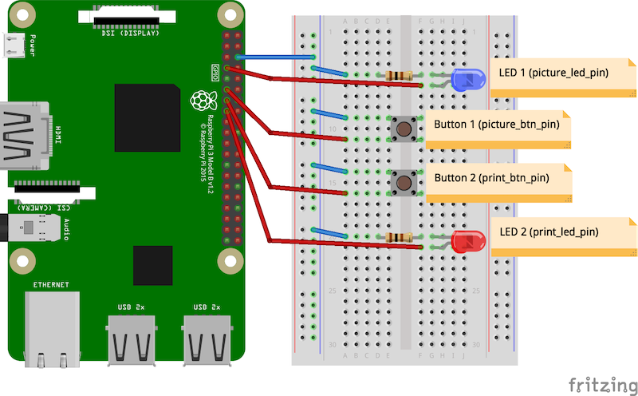

Requirements
------------

The requirements listed below are the ones used for the development of ``pibooth``,
but other configuration may work fine. **All hardware buttons, lights and printer
are optional**, the application can be entirely controlled using a keyboard, a
mouse or a touchscreen.

.. warning:: Using a Pi Camera, the preview is visible only on a screen connected
             to the HDMI or DSI connectors (the preview is an overlay managed at
             GPU low level). It also means that ``pibooth`` can not be started
             throught SSH tuneling. Even with X11 forwarding enabled (``ssh -X ...``)
             the preview will not be visible.

Hardware
^^^^^^^^

* 1 Raspberry Pi 3 Model B (or higher)
* 1 Camera (Raspberry Pi Camera v2.1 8 MP 1080p
  or any DSLR camera `compatible with gPhoto2 <http://www.gphoto.org/proj/libgphoto2/support.php>`_
  or any webcam `compatible with OpenCV <https://opencv.org>`_ )
* 2 push buttons
* 2 LEDs
* 2 resistors of 100 Ohm
* 1 printer

Software
^^^^^^^^

* Raspberry Pi OS **Bookworm** (64 bit) with desktop (`could be downloaded here <https://www.raspberrypi.com/software/operating-systems/>`_)
* Python ``3.10`` or higher
* libsdl2 ``2.0``
* libgphoto2 ``2.5.27``
* libcups ``2.2.10``

.. note:: Raspberry Pi OS **Trixie** has not been validated yet. Users have
          reported that ``sudo apt-get install libsdl2-*`` (step 4. below)
          behaves differently on it.

.. note:: Since Bookworm, the system Python is *externally managed*
          (:pep:`668`), which changes how ``pibooth`` has to be installed. Two
          methods are given at step 8., see :ref:`which_install_method`.

Install
-------

Here is a brief description on how to set-up a Raspberry Pi to use this software.

If you intend to develop on ``pibooth``, an editable/customizable version can be
installed. Instead of doing step 8. of the below procedure, follow
:ref:`instructions here<install_developing_version>`.

Manual procedure
^^^^^^^^^^^^^^^^

1. Download the Raspbian image and set-up an SD-card. You can follow
   `these instructions <https://www.raspberrypi.org/documentation/installation/installing-images/README.md>`_.

2. Insert the SD-card into the Raspberry Pi and fire it up. Use the
   ``raspi-config`` tool to configure your system (e.g., expand partition,
   change hostname, password, enable SSH, configure to boot into GUI, etc.).

   .. hint:: Don't forget to enable the camera in raspi-config.

3. Upgrade all installed software:

   .. code-block:: bash

        sudo apt-get update
        sudo apt-get full-upgrade

4. Install SDL2 (and extras) which is required by ``pygame 2+``:

   .. code-block:: bash

        sudo apt-get install libsdl2-*

5. Optionally install the last stable ``gPhoto2`` version (required only for
   DSLR camera):

   .. code-block:: bash

        wget https://raw.githubusercontent.com/gonzalo/gphoto2-updater/master/gphoto2-updater.sh
        wget https://raw.githubusercontent.com/gonzalo/gphoto2-updater/master/.env
        chmod +x gphoto2-updater.sh
        sudo ./gphoto2-updater.sh

6. Optionally install ``CUPS`` to handle printers (more instructions to add a
   new printer can be found `here <https://www.howtogeek.com/169679/how-to-add-a-printer-to-your-raspberry-pi-or-other-linux-computer>`_
   ):

   .. code-block:: bash

        sudo apt-get install cups libcups2-dev

7. Install the camera libraries you need. ``OpenCV`` also improves images
   generation efficiency, whichever camera is used:

   .. code-block:: bash

        sudo apt-get install python3-opencv      # webcam, and faster images generation
        sudo apt-get install python3-picamera2   # Raspberry Pi camera

   .. note:: ``python3-picamera2`` is already present on the Raspberry Pi OS
             desktop images. Install it with ``apt`` and not with ``pip``: two
             of its dependencies ship no pre-built package, so ``pip`` would
             have to compile them, and the ``libcamera`` binding it needs is not
             published on PyPI at all.

8. Install ``pibooth`` from the `pypi repository <https://pypi.org/project/pibooth/>`_.
   Pick the method matching how the Raspberry Pi is used — see
   :ref:`which_install_method` if you are unsure:

   **a. The Raspberry Pi is dedicated to the photobooth**

   .. code-block:: bash

        sudo pip3 install --break-system-packages pibooth[dslr,printer]

   **b. The Raspberry Pi is also used for something else**

   .. code-block:: bash

        python3 -m venv --system-site-packages ~/pibooth-venv
        ~/pibooth-venv/bin/pip install pibooth[dslr,printer]

   The application then starts with ``~/pibooth-venv/bin/pibooth`` instead of
   ``pibooth``.

   .. warning:: ``--system-site-packages`` is not optional. Without it the
                virtual environment cannot see the libraries installed with
                ``apt`` — those of step 7. and the GPIO ones — so no camera is
                detected and the buttons and LEDs stay inert.

   .. hint:: If you don't have ``gPhoto2`` and/or ``CUPS`` installed (steps 5. and/
          or 6. skipped), remove **printer** and/or **dslr** under the ``[]``.

          As a consequence if you only want to use gphoto2 (step 6 skipped):

          ``sudo pip3 install --break-system-packages pibooth[dslr]``

          Or if you only want to use the printer (step 5 skipped):

          ``sudo pip3 install --break-system-packages pibooth[printer]``

          The classic command ``sudo pip3 install --break-system-packages pibooth`` will install ``pibooth`` without these two dependencies (step 5 and 6 skipped).

9. Install the plugins you want, with the ``pip`` of the method chosen above:

   .. code-block:: bash

        sudo pip3 install --break-system-packages pibooth-qrcode
        # or, with a virtual environment
        ~/pibooth-venv/bin/pip install pibooth-qrcode

   The startup log lists what was actually loaded::

        [ INFO    ] pibooth: Installed plugins: qrcode-1.0.2

10. If you use the hardware buttons and LEDs, check that ``pibooth`` can reach
    the GPIO. Start it once and read the first log line:

    .. code-block:: bash

         pibooth --verbose

    ``pibooth`` reports which GPIO backend it obtained::

         [ INFO    ] pibooth: Starting the photo booth application on Raspberry pi 4B

    If it reports this instead, no GPIO backend could be loaded and the buttons
    and LEDs will do nothing::

         [ INFO    ] pibooth: Starting the photo booth application without physical GPIO, fallback to GPIO mock

    ``pibooth`` drives the GPIO through `gpiozero
    <https://gpiozero.readthedocs.io>`_, which looks for a backend at startup
    and tries ``lgpio``, ``RPi.GPIO``, ``pigpio``, then a pure Python fallback.
    Raspberry Pi OS ships those libraries in the **system** Python, so they are
    always reachable with method **a**, and only reachable with method **b**
    thanks to ``--system-site-packages``.

    .. note:: This line only tells you that a backend was loaded. It does not
              prove the wiring works — press both buttons and check that both
              LEDs light up.

.. _which_install_method:

Which installation method?
^^^^^^^^^^^^^^^^^^^^^^^^^^

Since Bookworm, the system Python is *externally managed* (:pep:`668`):
``pip`` refuses to install into it unless ``--break-system-packages`` is
passed. That flag is not as brutal as its name suggests, but it is not free
either.

``pip`` installs into ``/usr/local/lib/python3.X/dist-packages``, which comes
**before** the ``/usr/lib/python3/dist-packages`` used by ``apt`` in the
search path. So the libraries pulled by ``pibooth`` take precedence over the
ones packaged by Debian, for every program using the system Python. Nothing is
deleted and ``apt`` itself stays consistent — the effect is reversible by
uninstalling — but another Python application on the same machine may silently
end up running a version it was not tested against.

On a Raspberry Pi dedicated to the photobooth there is nothing else to
disturb, and method **a** keeps everything simple: ``apt`` libraries are
natively visible, plugins install with a plain ``pip install``, and the
``pibooth`` command is available system-wide.

On a Raspberry Pi doing other things, method **b** confines ``pibooth`` and
its dependencies to a single directory, at the cost of typing the full path to
the application.

Automated procedure
^^^^^^^^^^^^^^^^^^^

Alternatively, you can use Ansible to install pibooth automatically.
`A playbook can be found here <https://github.com/TiJof/pibooth_ansible>`_
(thank you **TiJof**).

Circuit diagram
---------------

Here is the diagram for hardware connections. Please refer to the
:ref:`default configuration file<Default configuration>`.
to know the default pins used (`physical pin numbering <https://pinout.xyz>`_).

An extra button can be added to start and shutdown properly the Raspberry Pi.
Edit the file ``/boot/config.txt`` and set the line:

.. code-block:: bash

    dtoverlay=gpio-shutdown

Then connect a push button between physical *pin 5* and *pin 6*.
