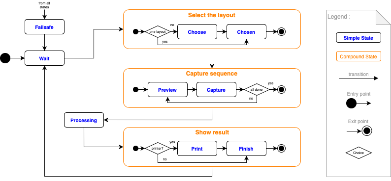

.. _extend_pibooth_functionalities:

Customize using plugins
-----------------------

The ``pibooth`` application is built on the top of
`pluggy <https://pluggy.readthedocs.io/en/latest/index.html>`_
that gives users the ability to extend or modify its behavior thanks to plugins.

Several plugins maintained by the community are available. They add extra features to
``pibooth``. Have a look to the `plugins on PyPI  <https://pypi.org/search/?q=pibooth>`_.

You can also easily develop your own plugin, and declare it in the ``[GENERAL][plugins]``
key of the configuration.

What is a plugin?
-----------------

A plugin is a set of functions (called ``hooks``) defined in a python module
and participating to the ``pibooth`` execution when they are invoked.

The list of available ``hooks`` are defined :ref:`on this chapter<hooks>`. A plugin
implements a subset of those functions.

There are 2 families of hooks implemented in `pibooth`:

 - Pibooth state-independent hooks
 - State dependant hooks (see below)

Influencing states
^^^^^^^^^^^^^^^^^^

The ``pibooth`` application is built on the principle of states. Each state
is defined by a specific screen and possible actions available to the user.

The following states are defined:

 - ``wait``       : wait for starting a new capture sequence
 - ``choose``     : selection of the number of captures
 - ``chosen``     : confirm the number of captures
 - ``preview``    : show preview and countdown
 - ``capture``    : take a capture
 - ``processing`` : build the final picture
 - ``print``      : show preview and ask for printing
 - ``finish``     : thank before going back to wait state
 - ``failsafe``   : oops message when an exception occurs

.. _state_sequence_details:

There are four hooks defined for each state.

 - ``state_<name>_enter``

   Invoked one time when the state is activating.

 - ``state_<name>_do``

   Invoked in a loop until the state is switching to an other one.

 - ``state_<name>_validate``

   Invoked in a loop, returns the name of the next state if all conditions
   are met (else return ``None``).

 - ``state_<name>_exit``

   Invoked one time when the state is exiting.

Code skeleton
^^^^^^^^^^^^^

A plugin is generally a Python module called ``pibooth_[...].py``. For a better
configuration management, it should have the constant ``__version__`` set to the
plugin version:

.. code-block:: python

    __version__ = "1.0.0"

The ``pibooth_configure`` hook permits to define some new configuration options.
At this step of the starting process, only the pre-loaded configuration is
available (application is not created yet).

.. code-block:: python

    @pibooth.hookimpl
    def pibooth_configure(cfg):
        cfg.add_option('CONTROLS', 'startup_led_pin', 29,
                       "Physical GPIO OUT pin to light a LED at pibooth startup")

The new objects, which should persist between states, can be created and attached
to the application instance in the ``pibooth_startup`` hook:

.. code-block:: python

    @pibooth.hookimpl
    def pibooth_startup(cfg, app):
        app.led_startup = LED("BOARD" + cfg.get('CONTROLS', 'startup_led_pin'))

Access to internal variables
^^^^^^^^^^^^^^^^^^^^^^^^^^^^

cfg
~~~

.. autoclass:: pibooth.config.parser.PiConfigParser
   :members: set, get, getint, getfloat, getboolean, gettyped, getpath, gettuple, add_option, join_path
   :undoc-members:

app
~~~

.. autoclass:: pibooth.booth.PiApplication
   :members:

win
~~~

.. autoclass:: pibooth.view.window.PiWindow
   :members:
