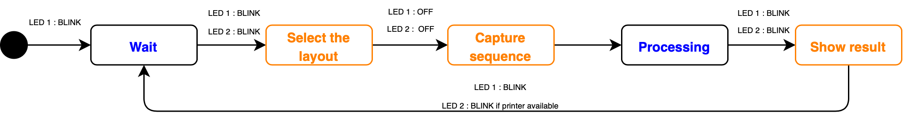
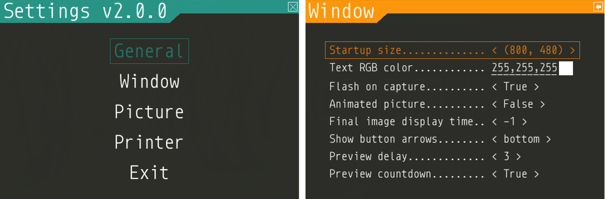

Run ``pibooth``
---------------

Start the ``pibooth`` application using the command:

.. code-block:: bash

    pibooth

All pictures taken are stored in the folder defined in ``[GENERAL][directory]``.
They are named **YYYY-mm-dd-hh-mm-ss_pibooth.jpg** which is the time when first
capture of the sequence was taken. A subfolder **raw/YYYY-mm-dd-hh-mm-ss** is
created to store the single raw captures.

.. note:: if you have both ``Pi`` and ``DSLR`` cameras connected to the Raspberry
          Pi, **both are used**, this is called the **Hybrid** mode. The preview
          is taken using the ``Pi`` one (Picamera2) for a better video rendering
          and the capture is taken using the ``DSLR`` one for better picture
          rendering.

You can display a basic help on application options by using the command:

.. code-block:: bash

    pibooth --help

States and lights management
^^^^^^^^^^^^^^^^^^^^^^^^^^^^

The application follows the states sequence defined in the simplified diagram
below:

The states of the **LED 1** and **LED 2** are modified depending on the actions
available for the user.

Detailed state diagram can be found :ref:`on this page section<state_sequence_details>`.

Controls
^^^^^^^^

After the graphical interface is started, the following actions are available:

======================= ================ ===================== =====================
Action                  Keyboard key     Physical button       Touch event
======================= ================ ===================== =====================
Toggle Full screen      Ctrl + F         \-                    \-
Capture / Validate      C                Button 1              Tap 1 finger
Print / Select          P                Button 2              Tap 1 finger
Open/close settings     ESC              Button 1 + Button 2   Tap 4 finger
Select option           UP or DOWN       Button 2              Tap 1 finger
Change option value     LEFT or RIGHT    Button 1              Tap 1 finger
======================= ================ ===================== =====================

Configure
---------

At the first run, a configuration file is generated in ``~/.config/pibooth/pibooth.cfg``
by default. This file permits to configure the behavior of the application.

A quick configuration GUI menu (see `Controls`_ ) gives access to the most common options:

More options are available by editing the configuration file which is easily
done using the command:

.. code-block:: bash

    pibooth --config

The default configuration can be restored with the command (strongly recommended when
upgrading ``pibooth``):

.. code-block:: bash

    pibooth --reset

The configuration directory can be chosen at startup. This feature gives the possibility
to keep several configurations on the same Raspberry Pi and quickly switch from one
configuration to another. The following command will start ``pibooth`` using configuration
files from ``myconfig1/`` directory:

.. code-block:: bash

    pibooth myconfig1/

:ref:`See the default configuration file for further details<Default configuration>`.

Final picture resolution
^^^^^^^^^^^^^^^^^^^^^^^^

The ``pibooth`` application handle the rendering of the final picture using 2
variables defined in the configuration (see :ref:`Configure` below):

* ``[CAMERA][resolution] = (width, height)`` is the resolution of the captured
  picture in pixels. As explained in the configuration file, the preview size is
  directly dependent from this parameter.
* ``[PICTURE][orientation] = auto/landscape/portrait`` is the orientation of the
  final picture (after concatenation of all captures). If the value is **auto**,
  the orientation is automatically chosen depending on the resolution.

.. note:: The resolution is an important parameter, it is responsible for the quality of the final
          picture. On Raspberry Pi, the camera is used via **Picamera2** (libcamera); supported
          resolutions depend on the sensor.

          For ``gphoto2`` camera, the possible resolutions can be listed by executing
          the following command (adapt device path as needed)::

            v4l2-ctl --list-formats-ext -d /dev/video0

Autofocus
^^^^^^^^^

Cameras with a motorized lens (Raspberry Pi Camera Module 3, some Arducam modules)
are driven by the ``[CAMERA][autofocus]`` option. It is required because
**Picamera2** does not enable the autofocus by default: the lens stays at the
position defined in the tuning file of the camera.

* **continuous**: the camera focuses permanently, like ``rpicam-hello`` does. This
  is the default value.
* **capture**: an autofocus cycle is run just before each capture, the focus is
  thus done on the people in front of the camera. It adds a short delay to the
  capture, but the lens does not search during the preview.
* **off**: the focus is fixed at ``[CAMERA][lens_position]``, given in diopters
  (1/meters): ``0`` is the infinity, ``0.5`` is 2 meters and ``2`` is 50
  centimeters. It is the most reproducible choice for a photobooth, where the
  distance between the camera and the people does not change.

.. code-block:: ini

    [CAMERA]

    # Autofocus of the camera (when it has a motorized lens): 'continuous', 'capture' or 'off'
    autofocus = capture

.. note:: Both options are ignored by the cameras having a fixed lens (Camera Module
          1 and 2, HQ camera) and by the ``gphoto2`` ones (for a DSLR, see
          :doc:`tutorials/dslr_tips`).

Captures effects
^^^^^^^^^^^^^^^^

Image effects can be applied on the capture using the ``[PICTURE][effect]`` option defined in the
configuration.

.. code-block:: ini

    [PICTURE]

    # Effect applied on all captures
    captures_effects = film

Instead of one effect name, a list of names can be provided. In this case, the effects are applied
sequentially on the captures sequence.

.. code-block:: ini

    [PICTURE]

    # Define a rolling sequence of effects. For each capture the corresponding effect is applied.
    captures_effects = ('film', 'cartoon', 'washedout', 'film')

Have a look to the predefined effects available depending on the camera used:

* **Picamera2** and **gPhoto2**: PIL-based effects (e.g. blur, contour, sharpen), see
  `PIL ImageFilter <https://pillow.readthedocs.io/en/latest/reference/ImageFilter.html>`_

Texts and fonts
^^^^^^^^^^^^^^^

Texts can be defined by setting the option ``[PICTURE][footer_text1]`` and ``[PICTURE][footer_text2]``
(lets them empty to hide any text). Some text can be inserted dynamically using some state variables.
Available variables to forge the footer texts are:

 - **date** : `datetime <https://docs.python.org/3/library/datetime.html#datetime-objects>`_ of the first capture of the current sequence
 - **count** : current counters (see counters in configuration menu)

For instance, insert the date in the footer text:

.. code-block:: ini

    [PICTURE]

    footer_text1 = The full date is {date}

    footer_text2 = A custom date is {date.year}-{date.month}-{date.day}

For each text, the font, the color and the alignment can be chosen. For instance, to change the font:

.. code-block:: ini

    [PICTURE]

    # Same font applied on footer_text1 and footer_text2
    text_fonts = Amatic-Bold

Different fonts can be defined for each text. It is achieved by setting two names (or TTF file paths)
in the ``[PICTURE][text_fonts]`` option:

.. code-block:: ini

    [PICTURE]

    # 'arial' font applied on footer_text1, 'Roboto-BoldItalic' font on footer_text2
    text_fonts = ('arial', 'Roboto-BoldItalic')

Here is the list of the fonts installed with ``pibooth``:

- Amatic-Bold
- AmaticSC-Regular
- DancingScript-Bold
- DancingScript-Regular
- Monoid-Bold
- Monoid-Regular
- Monoid-Retina
- Roboto-BoldItalic
- Roboto-LightItalic

Use the script :ref:`pibooth-fonts<scripts>` to list all available system fonts.

GUI translations
^^^^^^^^^^^^^^^^

The graphical interface texts are available in 9 languages by default: Danish, Dutch, English,
French, German, Hungarian, Italian, Norwegian, Spanish and Swedish. The default translations can be easily edited using the command:

.. code-block:: bash

    pibooth --translate

A new language can be added by adding a new section (``[alpha-2-code]``).
If you want to have ``pibooth`` in your language feel free to send us the corresponding keywords via a GitHub issue.

Printer
^^^^^^^

The print button (see `Controls`_) and print states are automatically activated/shown if:

* `pycups <https://pypi.python.org/pypi/pycups>`_ and `pycups-notify <https://github.com/anxuae/pycups-notify>`_ are installed
* at least one printer is configured in `CUPS <http://localhost:631/printers>`_
* the key ``[PRINTER][printer_name]`` is equal to ``default`` or an existing printer name

To avoid paper waste, set the option ``[PRINTER][max_duplicates]`` to the maximum
of identical pictures that can be sent to the printer.

Set the option ``[PRINTER][max_pages]`` to the number of paper sheets available on the
printer. When this number is reached, the print function will be disabled and an icon
indicates the printer failure. To reset the counter, open then close the settings
graphical interface (see `Controls`_).

Here is the default configuration used for this project in CUPS, it may depend on
the printer used:

================ =============================
Options          Value
================ =============================
Media Size       10cm x 15cm
Color Model      CMYK
Media Type       Glossy Photo Paper
Resolution       Automatic
2-Sided Printing Off
Shrink page ...  Shrink (print the whole page)
================ =============================

Specific printer options can be passed to the `CUPS` printer through ``[PRINTER][printer_options]`` option.

Plugins
^^^^^^^

Plugins installed via pip are enabled automatically at startup but two options are available in the config to handle specific cases.

.. code-block:: ini

    # Path to custom plugin(s) not installed with pip (list of quoted paths accepted)
    plugins = 

    # Plugin names to be disabled after startup (list of quoted names accepted)
    plugins_disabled = 

The first option allows to add a plugin which is not a pip package (could be useful for development). In this case, put the path to the plugin Python file.

The second option allows to disable a plugin without needing to uninstall it. The plugin name to be used is the Python module name (e.g. ``pibooth_qrcode`` for ``pibooth-qrcode`` plugin)

.. note:: Even if the plugin is disabled it will be listed in the ``Installed plugin`` section in the logs
